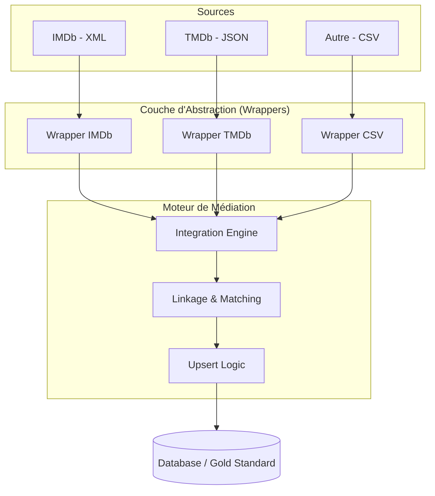

# Architecture & Implémentation du Pipeline d'Intégration

Ce document décrit l'architecture logicielle et la logique de réconciliation des données du projet. L'objectif est de transformer des sources disparates en un **Golden Record** (enregistrement de référence).

---

## 1. Schéma de l'Architecture Système

Nous utilisons une architecture **Mediator-Wrapper**. Ce motif permet d'isoler la complexité de chaque source (XML, CSV, JSON) derrière un contrat d'interface unique.

Ce choix permet de traiter efficacement un volume supérieur à **4 millions de lignes**, tout en conservant une architecture **simple et robuste**.

---

## 2. Description des couches du pipeline

### 2.1 Couche Bronze – Données brutes

**Source :**
- `en.openfoodfacts.org.products.csv.gz`

**Données non modifiées**, directement issues de la plateforme OpenFoodFacts.

**Problèmes connus :**
- valeurs manquantes  
- types incohérents  
- doublons par code-barres  
- champs texte très hétérogènes  

**Choix assumé :**  
Aucune transformation n’est appliquée en Bronze afin de garantir la **traçabilité** et de pouvoir **rejouer le pipeline à l’identique**.

---

### 2.2 Couche Silver – Nettoyage et standardisation (PySpark)

La couche Silver est implémentée en **PySpark**, exécutée sous **Linux/WSL**, environnement nativement compatible avec Spark.

#### Rôle de PySpark
- Lecture efficace de fichiers CSV volumineux  
- Traitements distribués et scalables  
- API DataFrame adaptée aux transformations de données complexes  

#### Transformations appliquées
- Déduplication des produits par `code` (conservation de la version la plus récente)
- Normalisation des champs texte (minuscules, trim, nettoyage)
- Conversion des nutriments en types numériques
- Neutralisation des valeurs hors bornes (ex. : sucres, sel)
- Calcul d’un score de complétude (**`completeness_score`**)
- Génération de métriques globales (`metrics_v2.json`)

#### Format de sortie
La couche Silver est stockée au format **Parquet**, choisi pour :
- sa compression efficace  
- ses performances en lecture  
- sa compatibilité avec Spark et les moteurs analytiques  

---

### 2.3 Couche Gold – DataMart MySQL

La couche Gold correspond au **stockage final analytique**.

#### Choix de MySQL
- Déploiement simple via Docker  
- SQL standard et largement maîtrisé  
- Suffisant pour les analyses demandées dans le cadre du projet  
- Accès facilité via phpMyAdmin  

#### Modélisation du DataMart
Le DataMart suit un **schéma étoile étendu**, composé de :

**Dimensions :**
- `dim_product`
- `dim_brand`
- `dim_category`
- `dim_country`
- `dim_time`

**Table de faits :**
- `fact_nutrition_snapshot`

**Table de pont :**
- `bridge_product_category`  
  *(relation N–N entre produits et catégories)*

Ce modèle permet :
- des jointures efficaces  
- une lecture analytique claire  
- des requêtes SQL maintenables et explicites  

---

## 3. Stratégie de chargement des données (Gold)

Le chargement de la couche Gold est réalisé via un script Python (`gold_openfoodfacts.py`) utilisant **Spark + JDBC**.

**Principes retenus :**
- Chargement par **append**
- Pas de suppression destructive
- Utilisation de clés techniques (`*_sk`)
- Exploitation de la dimension temps pour l’analyse temporelle

---

## 4. Gestion de la qualité des données

### Approche adoptée
Le projet adopte une approche **non destructive** :
- les anomalies sont identifiées, pas supprimées  
- la qualité est mesurée, pas imposée  

### Indicateurs utilisés
- `completeness_score` par produit  
- métriques globales issues de `metrics_v2.json`  
- détection d’anomalies via seuils nutritionnels (sel, sucres)  

**Remarque :**  
Le champ `quality_issues_json` est présent dans le modèle mais ressort **NULL** dans la base MySQL actuelle.  
Les analyses qualité reposent donc principalement sur les **scores** et **seuils calculés**.

---

## 5. Justification des choix technologiques

- **PySpark** : traitement distribué adapté aux gros volumes  
- **Parquet** : format colonne performant et compressé  
- **Python** : lisibilité et rapidité de développement  
- **MySQL** : suffisant pour l’analytique SQL demandée  
- **Docker** : reproductibilité de l’environnement  
- **WSL / Linux** : compatibilité native avec Spark  

---

Voici pourquoi nous avons sélectionné ces outils pour ce TP :
| Composant | Pourquoi ce choix ? |	Bénéfice pour le TP |
| :--- | :--- | :--- |
| Python & Pandas |	Utilisation de bibliothèques standards pour le traitement de données massives | Permet de manipuler les fichiers CSV, JSON et XML avec une grande flexibilité. |
| Normalisation | Nettoyage systématique (minuscules, retrait des caractères spéciaux et accents). | Garantit que "L'HIVER" et "l'hiver" soient reconnus comme une seule et même entité. |
| Fuzzy Matching | Utilisation de la distance de Levenshtein (algorithme de calcul de similarité). | Permet de lier des données malgré des fautes de frappe ou des variations de titres. |
| Blocking (Année) | Segmentation des comparaisons par année de production. | Optimise le temps de calcul en évitant de comparer des films qui ne peuvent pas être identiques. |
| Architecture Mediator | Centralisation de la logique de fusion dans un moteur unique. |	Facilite l'ajout de nouvelles sources de données sans modifier le code existant. |

---

## 6. Limites et perspectives

### Limites
- Forte hétérogénéité des catégories OpenFoodFacts  
- Qualité variable selon les marques  
- Moteur SQL non spécialisé OLAP  

### Perspectives
- Enrichissement de la taxonomie des catégories  
- Historisation avancée (SCD Type 2)  
- Migration vers un moteur analytique orienté colonne  

---

## 7. Conclusion

L’architecture mise en place est cohérente avec les objectifs du projet et les contraintes du jeu de données OpenFoodFacts.  
Elle permet une **ingestion robuste**, un **nettoyage contrôlé** et une **exploitation analytique claire** via un DataMart structuré.
