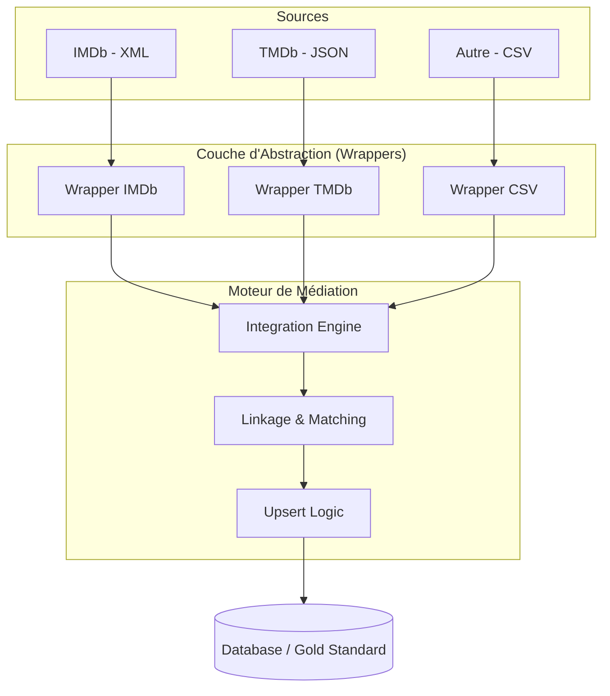

# Architecture & Implémentation du Pipeline d'Intégration

Ce document décrit l'architecture logicielle et la logique de réconciliation des données du projet. L'objectif est de transformer des sources disparates en un **Golden Record** (enregistrement de référence).

---

## 1. Schéma de l'Architecture Système

Nous utilisons une architecture **Mediator-Wrapper**. Ce motif permet d'isoler la complexité de chaque source (XML, CSV, JSON) derrière un contrat d'interface unique.

## 2. Logique de Réconciliation (Record Linkage)

L'un des défis majeurs de l'intégration est de comprendre que deux lignes provenant de sources différentes (ex: IMDb et TMDb) désignent le même film, même si l'écriture varie.

## A. La Similarité Textuelle (Fuzzy Matching)
Plutôt que de chercher une égalité parfaite (qui échouerait pour "Spider-Man" vs "Spiderman"), nous utilisons la Distance de Levenshtein.

**Le principe** : On compte le nombre minimal de modifications (ajout, suppression ou remplacement de caractères) pour passer d'un titre à l'autre.

**Le seuil de confiance** : Nous avons fixé un score de 85%. Si deux titres sont similaires à plus de 85% et partagent la même année de sortie, le système les considère comme identiques.

## B. La Stratégie d'Upsert (Mise à jour Intelligente)
Une fois le lien établi, le système applique une règle de fusion :

**Si le film est inconnu** : Création d'une nouvelle fiche (Insertion).

**Si le film existe déjà** : On complète les informations manquantes (ex: IMDb donne la note, TMDb donne le synopsis) sans créer de doublon (Mise à jour).

## 3. Implémentation de Référence (Python)

Voici le squelette technique utilisé pour l'intégration. Il repose sur le principe de Data Class pour le schéma médiateur.A. Le Modèle de Données (models.py)Pythonfrom dataclasses import dataclass
from typing import Optional

@dataclass
class Movie:
    title: str
    year: int
    director: Optional[str] = None
    rating: Optional[float] = None
    source: str = ""

    def get_pivot_id(self):
        """Génère une clé de blocage pour accélérer le matching"""
        clean_title = "".join(filter(str.isalnum, self.title)).lower()
        return f"{clean_title}_{self.year}"
B. Le Moteur d'Intégration (engine.py)Pythonfrom rapidfuzz import fuzz

class IntegrationEngine:
    def __init__(self, threshold=85):
        self.registry = {} # Stockage du Golden Record
        self.threshold = threshold

    def upsert(self, movie: Movie):
        p_id = movie.get_pivot_id()
        
        if p_id in self.registry:
            # Logique d'Update (Enrichissement)
            existing = self.registry[p_id]
            if not existing.director: existing.director = movie.director
            existing.rating = max(existing.rating or 0, movie.rating or 0)
        else:
            # Logique d'Insertion
            self.registry[p_id] = movie

## 4. Choix Techniques Justifiés

Voici pourquoi nous avons sélectionné ces outils pour ce TP :
| Composant | Pourquoi ce choix ? |	Bénéfice pour le TP |
| :--- | :--- | :--- |
| Python & Pandas |	Utilisation de bibliothèques standards pour le traitement de données massives | Permet de manipuler les fichiers CSV, JSON et XML avec une grande flexibilité. |
| Normalisation | Nettoyage systématique (minuscules, retrait des caractères spéciaux et accents). | Garantit que "L'HIVER" et "l'hiver" soient reconnus comme une seule et même entité. |
| Fuzzy Matching | Utilisation de la distance de Levenshtein (algorithme de calcul de similarité). | Permet de lier des données malgré des fautes de frappe ou des variations de titres. |
| Blocking (Année) | Segmentation des comparaisons par année de production. | Optimise le temps de calcul en évitant de comparer des films qui ne peuvent pas être identiques. |
| Architecture Mediator | Centralisation de la logique de fusion dans un moteur unique. |	Facilite l'ajout de nouvelles sources de données sans modifier le code existant. |

